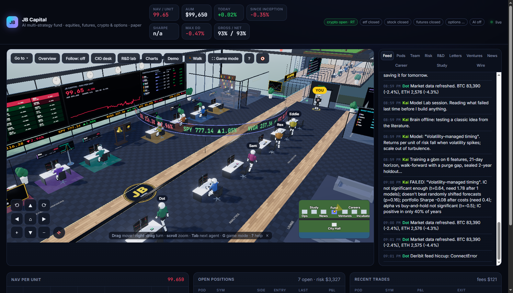
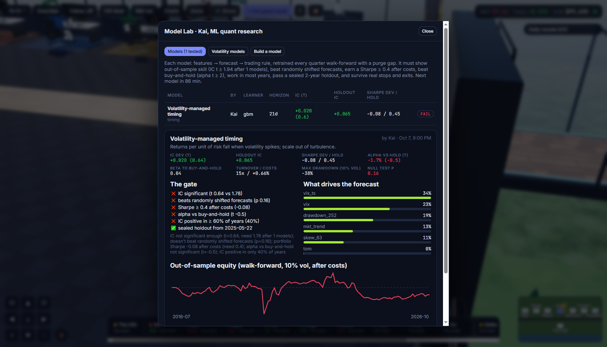
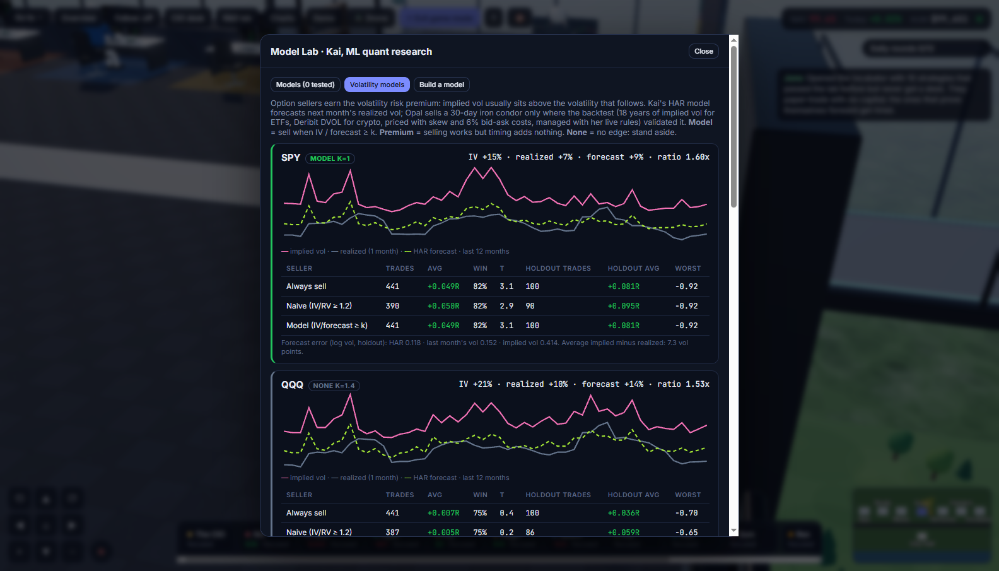
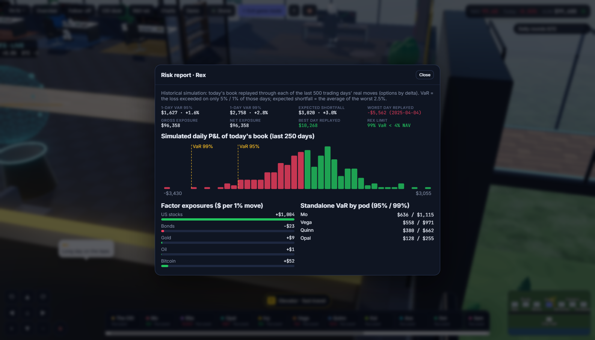

# The AI Hedge Fund Experiment

**What if a hedge fund was run entirely by AI agents that have to work together?**

JB Capital is an experiment by Jason Burmeister (18, first-year finance student) to find out whether a team of AI agents,
each with a real job, can find a genuine edge in the markets. It runs 24/7 on a small server, **paper trading** real
markets at live prices with realistic costs, and it's visualized as a 3D trading floor you can walk around.

> Paper money only. No real capital, no investors, nothing here is financial advice. Built with
> [Claude Code](https://claude.com/claude-code) as a pair programmer; the system design and the research process are mine.



## The team

| Role | What it does |
|---|---|
| **Portfolio managers** | Each runs its own strategy on 22 markets (US stock ETFs, sectors, bonds, gold, oil, Nvidia, micro futures, BTC/ETH/SOL) |
| **The CIO** | Allocates capital by evidence, reviews every trade (pass or a size multiplier, with reasons), switches the fund to defensive mode in drawdowns, reviews each PM's live results against its backtest |
| **Rex, risk** | Sizes every trade, enforces fund-wide limits, trims crowded positions, publishes a daily VaR / expected-shortfall report |
| **Lena, compliance** | Checks every order (restricted list, earnings blackout, wash-sale flags) and keeps a log |
| **Ava, research** | Invents new strategies from vetted building blocks and backtests them on 10+ years of data |
| **Kai, ML research** | Builds machine-learning forecasting models (features, horizon, learner) |
| **Opal, options** | Trades volatility (iron condors on crypto and SPY) only where a volatility model is validated |
| **Eddie, execution** | Fills orders, trails stops, runs time stops |
| **Ops & reporting** | Official NAV strike each day, end-of-day reports, an investor statement with shadow 2-and-20 fees |

I can walk the floor (WASD, first person with V), ask any agent a question in person, give floor announcements from a
podium, set the team's priorities, and trade alongside them from my own desk.

## How the research is kept honest

Most backtests lie. The point of this experiment is to find out what *doesn't* work, so every idea has to clear a strict gate:

- **Walk-forward testing** with a purge gap (models retrain every quarter on past data only).
- **A sealed 2-year holdout** that is never used to choose models.
- **A multiple-testing bar**: the significance threshold rises with every idea tested, so trying 50 variants can't fool it.
- **Beat random, not zero**: a strategy must beat random entry days with the same exits and costs. In a rising market,
  random long entries make money too.
- **Null models** for ML forecasts (randomly time-shifted forecasts must do worse), real transaction costs, and alpha
  measured against simply holding the same markets.
- **Monte Carlo risk sizing**, deflated Sharpe ratios and probability-of-backtest-overfitting checks for the strategies
  that pass.



## Early findings (Day 0: October 7, 2026)

- 4 of the 5 rule-based strategies **don't beat random entries** with the same exits; their returns were mostly the
  market going up. The CIO now treats them as beta and runs them at half size.
- Every ML model tested so far has **failed** the out-of-sample gate.
- One edge has held up: **selling options when implied volatility is rich** versus a HAR volatility forecast (SPY and
  BTC), backtested on 18 years of CBOE implied-volatility data and Deribit's DVOL.

Updates are posted every two weeks with the same scoreboard every time (paper NAV vs SPY, drawdown, strategies and models
tested / passed, trades, and every change I made to the system).



## Stack

Python (FastAPI, asyncio, pandas, numpy, scikit-learn), Three.js for the 3D floor, Alpaca (paper) and Deribit market data,
Yahoo Finance history, Claude for the agents' reasoning. One process runs the whole firm; state is a JSON file.

```
firm/            the agents: floor.py (the trading loop), cio.py, riskbook.py, riskreport.py, compliance.py, research.py,
                 quant/ (Model Lab: features, learners, validation, volatility models), voldesk.py, fundops.py, ...
static/          the 3D trading floor (game3d.js) and the dashboard
server.py        FastAPI + websocket server
deploy/          scripts to run it 24/7 on a small Linux server (dashboard reachable only over a private network)
docs/BUILD_LOG.md  the detailed build notes, version by version
```

## Run it

```bash
pip install -r requirements.txt
cp .env.example .env        # optional: Alpaca PAPER keys for live quotes and the paper broker
python server.py            # then open http://localhost:8000
```

`ALPACA_LIVE` stays `0`. Nothing in this repository trades real money.


